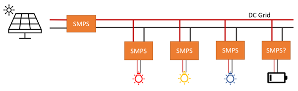
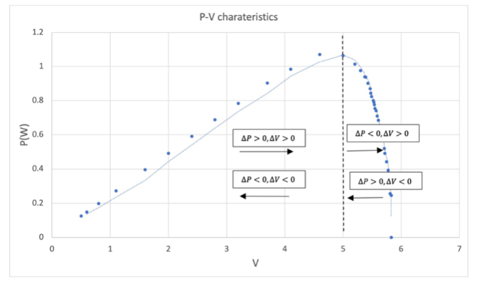
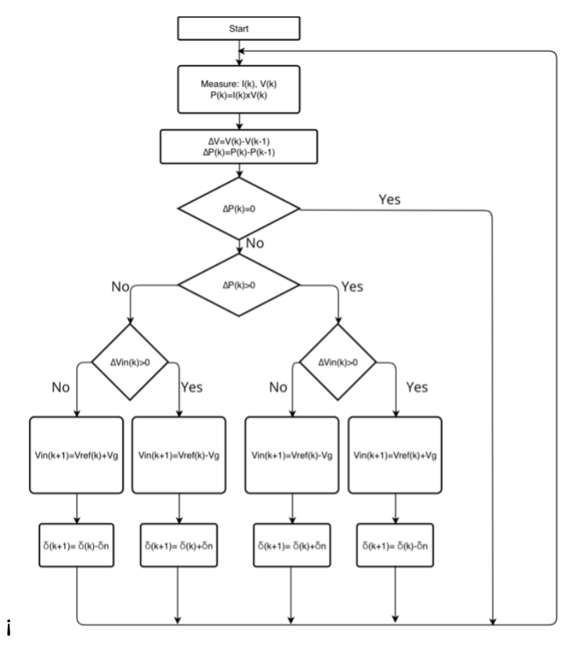
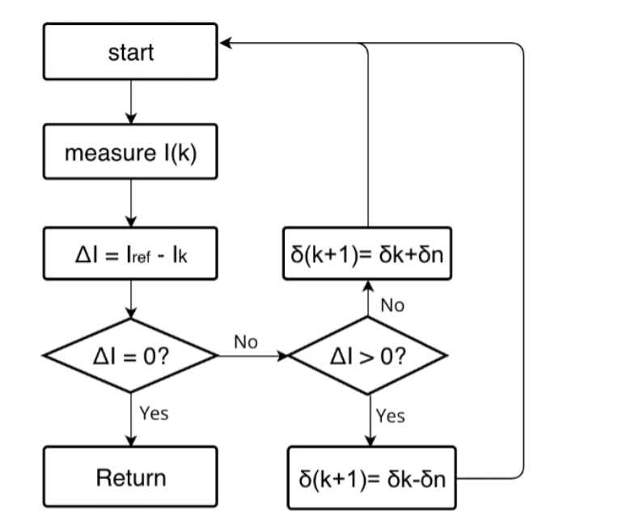

# Photovoltaic Cells in grid systems

The project focuses on addressing the power distribution challenge within a grid comprising three key elements: emulated photovoltaic(PV) panels, beacons (1W LEDs encased in ping pong balls), and a supercapacitor. Given the variable nature of PV systems due to environmental changes, it is imperative to constantly manage the supply and demand of power for the LEDs.

 

# Project Objectives:

- To provide sufficient power to the LEDs from emulated PV panels
- To maintain LEDs’ performance under all conditions. This includes the conditions where the excessive power can be stored in the capacitor, and conversely, when the PV panels fail to provide sufficient power, the stored energy can be utilized to supply the LEDs.

# Design Specification
## MPPT
The project's initial phase involves the development of MPPT algorithms aimed at maintaining operation at the voltage corresponding to the maximum power point (MPP) according to the P-V characteristics. To achieve this, the Perturb and Observation Method (P&O) has been selected as it offers a reasonable approximation for MPP tracking.

The algorithm is coded in .ino format and is implemented on an Arduino Uno. Through this setup, the Arduino sends PWM signals that adjust the on and off cycles of the MOSFET located within a boost SMPS. This boost SMPS is connected to the PV panels. The primary objective of this algorithm is to continually monitor and adjust the power output of the SMPS to ensure it remains at its maximum point.

The flow chart visually depicts the decision tree based on the I-V and P-V characteristics. The maximum power point (MPP) is attained when the change in power concerning voltage is zero (dP /dV = 0). This signifies that the PV panel is operating at its peak power output. Alternatively, each branch within the chart indicates whether the value is on the left or right side of the MPP and whether it is moving closer to or farther away from it. When approaching the MPP from the left, voltage can be increased, whereas approaching from the right necessitates a voltage decrease to reach the MPP.

 

 

## Closed Loop Control
The second part of the project involves developing a closed-loop control scheme to adjust the duty cycle for controlling the power across LEDs. In this context, current control is employed because LEDs are current-driven devices. The control system is executed using a Raspberry Pico W, which is programmed by Micropython. This functionality is implemented by a script called "current_control.py”.

The process begins by setting a reference current, which is then compared to the measured output voltage with a tolerance of ±5mA. Based on this comparison, the duty cycle is adjusted accordingly. The incrementing of the duty cycle is achieved by modifying the variable "pwm out."

 

## Data Transmission
The final phase of the project involves transmitting LED-related data to the server, with implementation detailed in the UI folder. Utilizing the Raspberry Pico W, a Wi-Fi connection is established, and the "current_control.py" script incorporates the necessary logic. This includes using the "urequest" library to send JSON-formatted data via HTTP requests to a specific API endpoint on the backend server. The backend, represented by the "index.js" file, processes this incoming data and updates the AWS database using SQL requests. Simultaneously, the front-end user interface, as described in the "table.js" file, sends requests to the server to retrieve and display beacon data, ensuring seamless communication between the LED control system and the server-based database and user interface.
